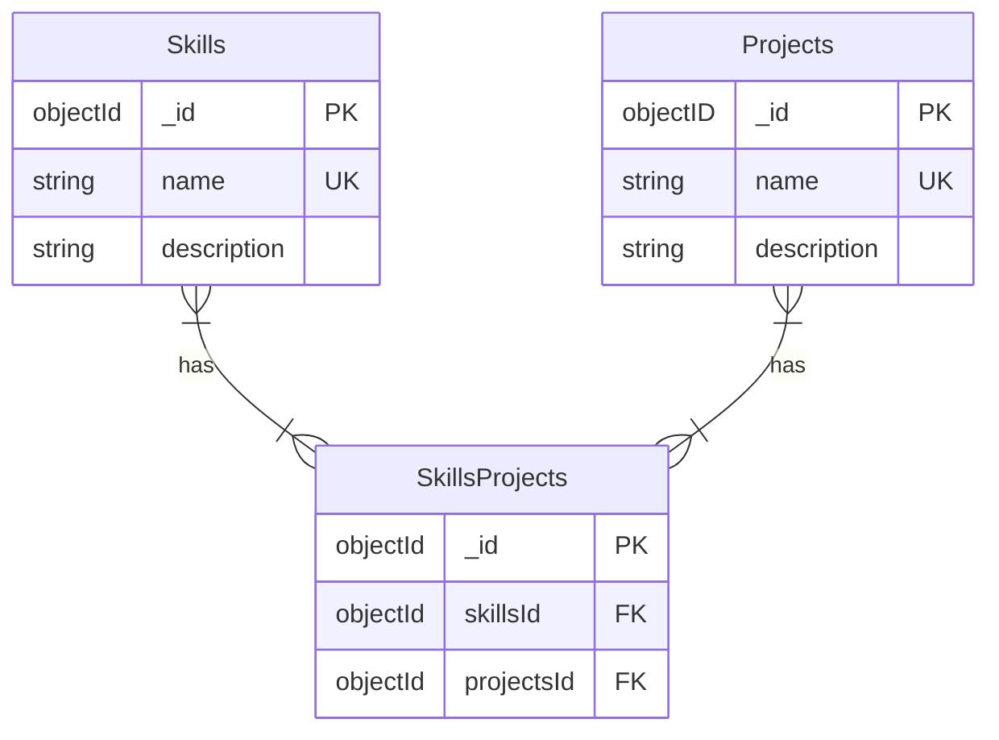

# My portfolio API previously known as Job Hunting Helper

This is a project to access a list of my skills and the projects related to them. The API serves as the bridge between my future portfolio website and the database where all information is saved. This API only can access the database, it can't modify it, to do operations in the database I'm planning to create a command line utility, probably with Typer.

## Motivation

This project started as an app to keep track of my job applications, but as I was developing it I realized that I was more interested in keeping track of my skills and the projects related to them. So I decided to change the focus of the app. This forms the API of my portfolio. The front end will be in another repository.

## Technologies used

- FastAPI
- ODMantic to connect to MongoDB

## Diagrams

### Entity Relationship Diagram (ERD)

## User stories

- [ ] 1 - Retrieve a skill
  As a person who wants to keep track of my skills, I want to retrieve a skill, so that I can see its details.

  Acceptance criteria:
  - [ ] I can retrieve a skill by its name
  - [ ] I can retrieve a skill's description
  - [ ] I can retrieve a skill's projects

- [ ] 2 - Retrieve all skills
  As a person who wants to keep track of my skills, I want to retrieve all skills, so that I can see all of them.

  Acceptance criteria:
  - [ ] I can retrieve all skills

- [ ] 3 - Retrieve a project
  As a person who wants to keep track of my skills, I want to retrieve a project, so that I can see its details.

  Acceptance criteria:
  - [ ] I can retrieve a project by its name
  - [ ] I can retrieve a project's description
  - [ ] I can retrieve a project's links
  - [ ] I can retrieve a project's skills

- [ ] 4 - Retrieve all projects
  As a person who wants to keep track of my skills, I want to retrieve all projects, so that I can see all of them.

  Acceptance criteria:
  - [ ] I can retrieve all projects
