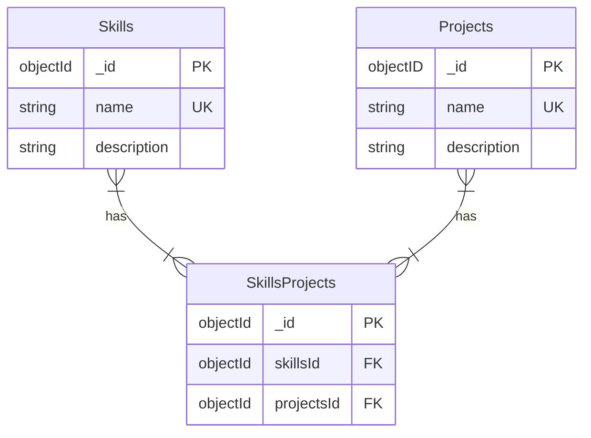

# My portfolio API previously known as Job Hunting Helper

This is a project to keep track of my skills and the projects related to them. It is the API of my portfolio.

## Motivation

This project started as an app to keep track of my job applications, but as I was developing it I realized that I was more interested in keeping track of my skills and the projects related to them. So I decided to change the focus of the app. This forms the API of my portfolio. The front end will be in another repository.

## Technologies used

- FastAPI
- MongoDB

## Diagrams

### Entity Relationship Diagram (ERD)

## User stories

- [ ] 1 - Register a new skill
  As a person who wants to keep track of my skills, I want to register a new skill, so that I can keep track of it.

  Acceptance criteria:
  - [ ] I can register a new skill
  - [ ] The skill consists of a name
  - [ ] The skill has a description (optional)
  - [ ] The skill has a list of projects related to it which can be empty

- [ ] 2 - Retrieve a skill
  As a person who wants to keep track of my skills, I want to retrieve a skill, so that I can see its details.

  Acceptance criteria:
  - [ ] I can retrieve a skill by its name

- [ ] 3 - Retrieve all skills
  As a person who wants to keep track of my skills, I want to retrieve all skills, so that I can see all of them.

  Acceptance criteria:
  - [ ] I can retrieve all skills

- [ ] 4 - Update a skill
  As a person who wants to keep track of my skills, I want to update a skill, so that I can keep it up to date.

  Acceptance criteria:
  - [ ] I can update a skill by its name
  - [ ] I can update a skill's description
  - [ ] I can modify a skill's name
    - [ ] If the new name is already in use, the skill's name is not modified
  - [ ] I can update a skill's projects
    - [ ] I can add a project to a skill
      - [ ] If the project doesn't exist, it is created
    - [ ] I can remove a project from a skill

- [ ] 5 - Delete a skill
  As a person who wants to keep track of my skills, I want to delete a skill, so that I can remove it from my list.

  Acceptance criteria:
  - [ ] I can delete a skill by its name

- [ ] 6 - Register a new project
  As a person who wants to keep track of my skills, I want to register a new project, so that I can keep track of it.

  Acceptance criteria:
  - [ ] I can register a new project
  - [ ] The project consists of a name
  - [ ] The project has a description
  - [ ] The project has a list of links that can be empty
  - [ ] The project has a list of skills related to it which can be empty

- [ ] 7 - Retrieve a project
  As a person who wants to keep track of my skills, I want to retrieve a project, so that I can see its details.

  Acceptance criteria:
  - [ ] I can retrieve a project by its name

- [ ] 8 - Retrieve all projects
  As a person who wants to keep track of my skills, I want to retrieve all projects, so that I can see all of them.

  Acceptance criteria:
  - [ ] I can retrieve all projects

- [ ] 9 - Update a project
  As a person who wants to keep track of my skills, I want to update a project, so that I can keep it up to date.

  Acceptance criteria:
  - [ ] I can update a project by its name
  - [ ] I can update a project's description
  - [ ] I can update a project's link
  - [ ] I can modify a project's name
    - [ ] If the new name is already in use, the project's name is not updated
  - [ ] I can update a project's skills
    - [ ] I can add a skill to a project
      - [ ] If the skill doesn't exist, it is created
    - [ ] I can remove a skill from a project

- [ ] 10 - Delete a project
  As a person who wants to keep track of my skills, I want to delete a project so that I can remove it from my list.

  Acceptance criteria:
  - [ ] I can delete a project by its name
